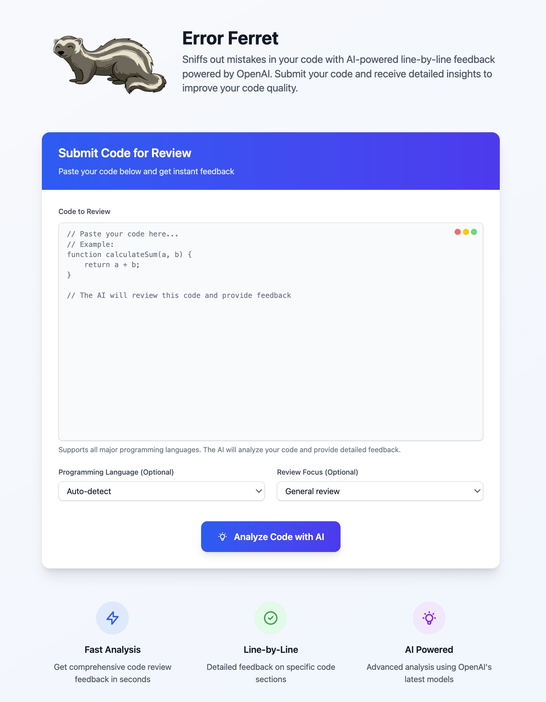

# Error Ferret

A modern, AI-powered code review application built with AstroJS and OpenAI's GPT-4. Submit your code and receive detailed, line-by-line feedback to improve code quality, security, and best practices.



## ✨ Features

- **AI-Powered Analysis**: Leverages OpenAI's GPT-4 for intelligent code review
- **Multi-Language Support**: Works with JavaScript, TypeScript, Python, Java, C++, and more
- **Focused Reviews**: Choose specific focus areas like security, performance, or readability
- **Beautiful UI**: Modern, responsive design built with Tailwind CSS
- **Real-time Results**: Instant feedback with loading states and error handling
- **Cloudflare Ready**: Optimized for deployment on Cloudflare Workers

## 🚀 Quick Start

### Prerequisites

- **Node.js** 18.0.0 or higher
- **npm** or **yarn** package manager
- **OpenAI API Key** ([Get one here](https://platform.openai.com/api-keys))

### Installation

1. **Clone the repository**
   ```bash
   git clone <your-repo-url>
   cd error-ferret
   ```

2. **Install dependencies**
   ```bash
   npm install
   ```

3. **Set up environment variables**
   ```bash
   cp env.template .env
   ```

   Edit `.env` and add your OpenAI API key:
   ```env
   OPENAI_API_KEY=your_actual_api_key_here
   ```

4. **Start development server**
   ```bash
   npm run dev
   ```

5. **Open your browser**
   Navigate to [http://localhost:4321](http://localhost:4321)

## 🏗️ Development

### Available Scripts

| Command | Description |
|---------|-------------|
| `npm run dev` | Start development server with hot reload |
| `npm run build` | Build for production |
| `npm run preview` | Preview production build locally |
| `npm run deploy` | Build and deploy to Cloudflare Workers |

### Project Structure

```
src/
├── components/          # Reusable UI components
├── layouts/            # Page layout templates
├── pages/              # Astro pages and API routes
│   ├── index.astro     # Main application page
│   └── api/            # API endpoints
│       └── review.astro # Code review API
├── scripts/            # Client-side JavaScript
│   └── review.js       # Form handling and API calls
├── styles/             # Global CSS and Tailwind
└── constants.ts        # Application constants
```

### Key Files

- **`src/pages/index.astro`** - Main application interface
- **`src/pages/api/review.astro`** - OpenAI API integration
- **`src/scripts/review.js`** - Frontend form handling
- **`astro.config.mjs`** - Astro configuration
- **`wrangler.toml`** - Cloudflare Workers configuration

## 🌐 Deployment

### Cloudflare Workers (Recommended)

1. **Install Wrangler CLI**
   ```bash
   npm install -g wrangler
   ```

2. **Login to Cloudflare**
   ```bash
   wrangler login
   ```

3. **Set environment variables**
   ```bash
   wrangler secret put OPENAI_API_KEY
   ```

4. **Deploy**
   ```bash
   npm run deploy
   ```

### Alternative: Cloudflare Pages

1. **Build the project**
   ```bash
   npm run build
   ```

2. **Upload `dist/` folder** to Cloudflare Pages
3. **Set environment variables** in the Cloudflare dashboard

### Environment Variables

| Variable | Description | Required |
|----------|-------------|----------|
| `OPENAI_API_KEY` | Your OpenAI API key | ✅ Yes |

## 🔧 Configuration

### OpenAI Settings

Modify the AI behavior in `src/pages/api/review.astro`:

```typescript
// Change model, tokens, or temperature
const openaiResponse = await fetch('https://api.openai.com/v1/chat/completions', {
  // ...
  body: JSON.stringify({
    model: 'gpt-4',           // Change to gpt-3.5-turbo for cost savings
    max_tokens: 2000,         // Adjust response length
    temperature: 0.3,         // Control creativity (0.0 = focused, 1.0 = creative)
  }),
});
```

### System Prompts

Customize the AI's behavior by editing the system prompt:

```typescript
const systemPrompt = `You are an expert code reviewer. Analyze the provided code and provide detailed, constructive feedback. Focus on:
- Code quality and best practices
- Potential bugs or issues
- Performance considerations
- Security concerns
- Readability and maintainability
- Suggestions for improvement

Provide specific line-by-line feedback where appropriate.`;
```

### Styling

The application uses Tailwind CSS. Modify classes in the Astro components to change appearance:

```astro
<!-- Example: Change button colors -->
<button class="bg-blue-600 hover:bg-blue-700 text-white">
  Submit Code
</button>
```

## 🐛 Troubleshooting

### Common Issues

| Problem | Solution |
|---------|----------|
| **"OpenAI API key not configured"** | Check `.env` file and restart dev server |
| **"Failed to get AI review"** | Verify API key validity and check OpenAI credits |
| **Form not submitting** | Check browser console for JavaScript errors |
| **Build errors** | Ensure `@astrojs/cloudflare` is installed |
| **API routes not working** | Verify `output: 'server'` in `astro.config.mjs` |

### Debug Mode

Enable detailed logging by checking the browser console and server logs:

```bash
# Check for build issues
npm run build

# Check for TypeScript errors
npm run astro check
```

## 🔒 Security Considerations

- **Never commit** `.env` files to version control
- **Use Cloudflare secrets** for production environment variables
- **Implement rate limiting** for production deployments
- **Add authentication** if deploying publicly
- **Monitor API usage** to prevent abuse

## 📚 API Reference

### POST `/api/review`

Submit code for AI review.

**Request Body (FormData):**
- `code` (required): The code to review
- `language` (optional): Programming language for context
- `focus` (optional): Review focus area

**Response:**
```json
{
  "review": "AI-generated review content...",
  "language": "javascript",
  "focus": "security",
  "timestamp": "2024-01-01T12:00:00.000Z"
}
```

**Error Response:**
```json
{
  "error": "Error message description"
}
```

## 🤝 Contributing

1. Fork the repository
2. Create a feature branch (`git checkout -b feature/amazing-feature`)
3. Commit your changes (`git commit -m 'Add amazing feature'`)
4. Push to the branch (`git push origin feature/amazing-feature`)
5. Open a Pull Request

## 📄 License

This project is licensed under the MIT License - see the [LICENSE](LICENSE) file for details.

## 🙏 Acknowledgments

- Built with [Astro](https://astro.build)
- Styled with [Tailwind CSS](https://tailwindcss.com)
- Powered by [OpenAI GPT-4](https://openai.com)
- Deployed on [Cloudflare Workers](https://workers.cloudflare.com)

---

**Need help?** Check the [SETUP.md](SETUP.md) file for detailed setup instructions or open an issue on GitHub.
